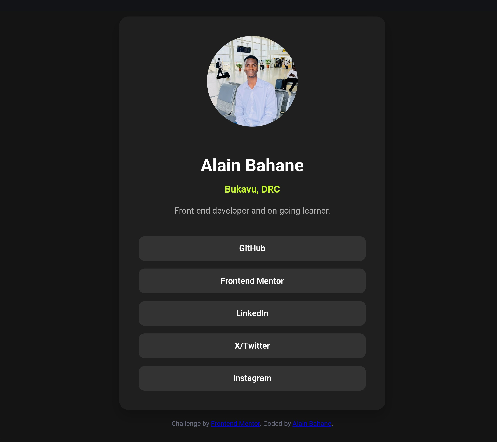

# Frontend Mentor - Social Links Profile Solution

This is a solution to the [Social Links Profile challenge on Frontend Mentor](https://www.frontendmentor.io/challenges/social-links-profile-UG32l9m6dQ). Frontend Mentor challenges help you improve your coding skills by building realistic projects.

## Table of Contents

- [Overview](#overview)
  - [The Challenge](#the-challenge)
  - [Screenshot](#screenshot)
  - [Links](#links)
- [My Process](#my-process)
  - [Built With](#built-with)
  - [What I Learned](#what-i-learned)
  - [Continued Development](#continued-development)
  - [Useful Resources](#useful-resources)
  - [AI Collaboration](#ai-collaboration)
- [Author](#author)
- [Acknowledgments](#acknowledgments)

## Overview

### The Challenge

Users should be able to:

- See hover and focus states for all interactive elements on the page
- View a clean, responsive social profile card
- Navigate social links easily (GitHub, LinkedIn, Frontend Mentor, Instagram, Twitter)

### Screenshot

### Links

- Solution URL: [View Repository](https://github.com/FreeDev-Group/Social-Links-Profile-Alain)
- Live Site URL: [View Live Site](https://freedev-group.github.io/Social-Links-Profile-Alain/)

## My Process

### Built With

- Semantic HTML5 markup
- CSS custom properties
- Flexbox
- Mobile-first workflow

> **Note:** React, Next.js, or other frameworks are **not used** in this project.

### What I Learned

- How to structure a responsive profile card using HTML and CSS
- How to create hover effects for interactive social links
- How to apply consistent colors and typography following a style guide

### Continued Development

- Improve personalization of the profile card content
- Enhance accessibility for keyboard navigation and screen readers
- Experiment with subtle animations and micro-interactions

### Useful Resources

- [Frontend Mentor](https://www.frontendmentor.io/) – The challenge source and inspiration
- [Google Fonts - Inter](https://fonts.google.com/specimen/Inter) – Used for typography

### AI Collaboration

- Tool used: **ChatGPT**  
- How it was used: Assisted in writing HTML, CSS, and README structure, suggested clean commit separation strategies
- Notes: Helped speed up development and ensured professional structure

## Author

- **Alan Bahane**  
- Frontend Mentor - [@alainbahanep](https://www.frontendmentor.io/profile/alainbahanep)  
- Twitter - [@alainbaha](https://x.com/alainbaha)

## Acknowledgments

- Mentor: **Salomon Mwilo**  
- AI Assistant: **ChatGPT**  
- Frontend Mentor for the challenge inspiration